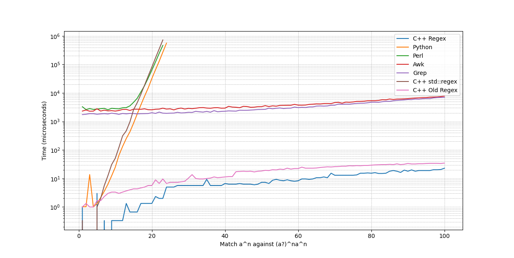

# Regex

A C++ implementation of a regular expression engine. This engine uses a varitation of Thompson's NFA construction, where each character/metacharacter creates exactly one state, to build an NFA from a regular expression, it then does a BFS through the NFA over an input to determine a match. Matching a full string against the NFA is O(m) time where m is the size of the string.

Matching a<sup>n</sup> against a?<sup>n</sup>a<sup>n</sup>. Regex(blue) compared to other regular expression implementations. This example is superlinear O(nm) as the regular expression and string grow linearly.

## Installation
```bash
git clone https://github.com/joey8angelo/Regex
cd Regex
mkdir build
cd build
cmake ..
make install
```

## Usage
Include the header file.

```c++
#include <Regex/Regex.h>

Regex r("hello (friend)|(world)!");
```

- Regex::find(std::string) - returns a std::tuple<bool, size_t, size_t> denoting if a match was found and the start and end position of the match. If there is no match the tuple will be (false, 0, 0).

```c++
r.find("hello friend!");
    // returns (true, 0, 13)
r.find("goodbye... actually hello world! is what I meant");
    // returns (true, 20, 32)
r.find("goodbye world, for real");
    // returns (false, 0, 0)
```

- Regex::test(std::string) - returns a boolean value if there are any matches in the string.

```c++
r.test("hello world!");
    // returns true
r.test("abc123 hello world! 123abc");
    // returns true
r.test("hello 123 world!");
    // returns false
```

- Regex::find_all(std::string) - returns a std::vector<std::pair<size_t, size_t>>, a vector of start and end positions of each match in the string. If there are no matches then the vector will be empty.

```c++
r.find_all("hello friend! hello world! 123 hello world!");
    // returns {(0, 13), (14, 26), (31, 43)}
```

## Special Symbols

- \\ - Escape symbol, detailed in Special Escape Characters
- . - Wildcard symbol, defined as [^\n\r]
- ? - Zero or one operator, detailed in Operators
- \* - Zero or more operator
- \+ - One or more operator
- | - Or operator
- [] - Character class open and close
- \- - Range, detailed in Character Classes
- {} - Range operator open and close
- ^ - If the caret is at the start of the regex it means match from the beginning, if at the start of a character class it means negate the class
- $ - Only when the dollar sign is at the end of the regex does it mean match from the end

## Operators

### Unary operators
Unary operators only have one operand on the left hand side. Any single character, character class, or group will be affected by these operators following them.

- ? - Zero or one, the operand can be matched zero or one times
- \* - Zero or more, the operand can be matched zero or more times
- \+ - One or more, the operand can be matched one or more times
- {} - Range
	+ {a} - A single digit means repeat the operand a times
	+ {a,} - A single digit with a comma means repeat the operand a times followed by the operand zero or more times
	+ {a,b} - Two comma separated digits means repeat the operand a-b times

### Alternation Operator
The | operator has more than one operand. The | operates on the character/group/character class on its right hand side and its left hand side. For example, (abc|def|ghi) is equivalent to ab(c|d)e(f|g)hi. To write the previous example correctly would be (abc)|(def)|(ghi). Chained alternations parse recursively, so this examples NFA would more closely resemble (abc)|((def)|(ghi)).

## Character Classes
A character class is defined with []. Any symbol inside is treated literally except for some special symbols, '-', '[', ']', which must be escaped: \\[, \\], \\-.

Character classes cannot be nested, which means that escaped special characters will be treated as normal characters: [\\w] -> [w].

The range symbol '-' inserts all characters in between the two operands, [0-5] -> [012345]. The left hand side must be smaller than the right hand side.

Special ranges are allowed, [\x21-\x2C] -> [!"#$%&'()\*+,-./], all characters seen in the range are treated literally.

## Special Escape Characters
Escape characters have special meanings within the regular expression. Any built in escape characters can also be used normally: \n,\r...

- \\d - Digits, [0-9]
- \\D - Non-digits, [^0-9]
- \\s - Whitespace, [\t\n\v\f\r \xA0]
- \\S - Non-whitespace, [^\t\n\v\f\r \xA0]
- \\w - Word characters, [a-zA-Z0-9_]
- \\W - Non-word characters, [^a-zA-Z0-9_]

If the character following the \\ is not a special character then it will be treated literally, good for escaping special symbols like operators \\?.
